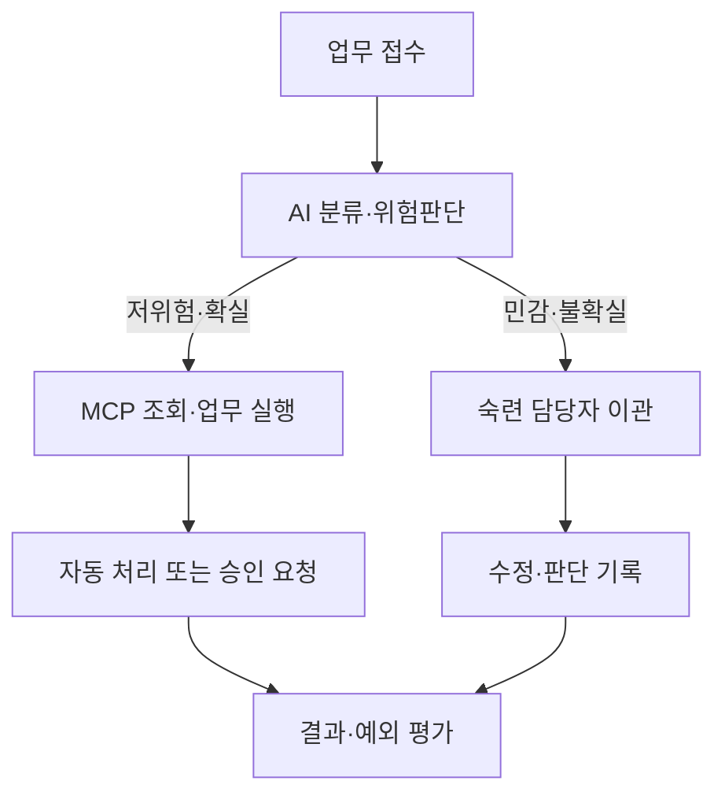

# MCP 사례의 AX 수준·업무 범위·완결성 및 파급력 평가기준

**작성일:** 2026-08-08  
**적용대상:** 공공 AX 사례 아카이브(PAX)의 MCP 개발·제공·활용 사례

---

## 1. 결론

MCP 개발·제공 자체는 원칙적으로 **AI-Ready**로 분류하는 것이 가장 일관된다. MCP는 AI가 API, 데이터, 검색기능, 업무도구에 접근할 수 있도록 표준화된 인터페이스를 만드는 준비행위이기 때문이다.

다만 MCP는 일반적인 데이터 정비보다 AI-First와 AI-Native 전환에 미치는 잠재적 파급력이 크며, 동일한 MCP라도 원자적 데이터 조회부터 다기관 서비스까지 지원 범위와 완결성이 크게 다르다. 따라서 MCP 사례는 AX 단계 하나로만 평가하지 않고 다음 네 축으로 평가하는 것이 적절하다.

> **AX 단계 × 업무 범위(S1～S5) × 업무 완결성(C0～C5) × MCP 파급력(M1～M5)**

이 방식은 MCP의 현재 업무성과를 과대평가하지 않으면서도, MCP가 어느 수준의 업무를 얼마나 완결적으로 지원하며 에이전틱 자동화와 기관 간 상호운용성에 어떤 파급력을 갖는지를 함께 표현한다.

| 평가축 | 핵심 질문 |
|---|---|
| AX 단계 | AI가 현재 업무와 핵심 가치생산에 얼마나 깊이 들어갔는가? |
| 업무 범위 S1～S5 | MCP가 원자적 기능부터 다기관 생태계까지 어디까지 다루는가? |
| 업무 완결성 C0～C5 | 시작부터 종료·예외·학습·복원까지 얼마나 연결되어 있는가? |
| MCP 파급력 M1～M5 | 얼마나 많은 모델·시스템·기관이 재사용하고 확장할 수 있는가? |

---

## 2. MCP 개발은 왜 AI-Ready인가

MCP 서버를 개발하거나 제공한다는 것은 일반적으로 다음과 같은 AI 활용조건을 마련한다는 의미다.

- AI가 데이터와 도구를 발견할 수 있는 표준 인터페이스
- 도구의 목적·입력·출력에 대한 기계가독형 설명
- API·데이터·업무기능에 대한 접근경로
- 인증·권한통제·감사로그를 적용할 수 있는 연결지점
- 여러 모델과 에이전트가 재사용할 수 있는 상호운용성
- 검색·조회에서 쓰기·업무실행으로 발전할 수 있는 기반

즉 MCP는 AI가 업무를 수행할 수 있는 `Integration-ready` 또는 `Agentic-ready` 조건을 만든다. 그러나 MCP 서버만 존재하고 실제 업무결과를 AI가 만들지 않는다면 아직 AI-Enabled라고 보기는 어렵다.

> API가 존재한다고 디지털 전환이 완료된 것이 아니듯, MCP가 존재한다고 업무가 이미 AI로 전환된 것은 아니다.

따라서 공공데이터·법령·통계·규정을 제공하는 MCP 서버 자체는 다음과 같이 표시하는 것이 적절하다.

> **AI-Ready / Integration-ready / MCP Server**

---

## 3. MCP와 AX 4단계의 관계

| MCP의 현재 활용상태 | AX 단계 | 판정 기준 |
|---|---|---|
| MCP 서버 개발·데이터 제공 | AI-Ready | AI가 데이터·API·도구에 접근할 표준화된 조건을 제공 |
| MCP를 이용해 업무 산출물 생성 | AI-Enabled | AI가 MCP를 호출해 실제 업무결과를 만들고 사람이 검증 |
| MCP를 전제로 업무 흐름과 역할 재설계 | AI-First | 복수 MCP·시스템을 연결하고 자동처리·인간이관·예외관리를 설계 |
| MCP가 핵심 가치·학습·복원 구조에 결합 | AI-Native | 사용결과가 지속 개선으로 환류되고 장애·공급자 변화에도 서비스 유지 |

### 3.1 AI-Ready: MCP를 개발·제공

다음과 같은 사례가 해당한다.

- 법령·정부문서·통계 데이터를 MCP 서버로 제공
- 기존 공공 API를 MCP 도구로 변환
- 기관 규정을 MCP 검색용으로 구조화
- 여러 공공데이터 MCP를 통합 호스트나 게이트웨이로 제공
- 로컬·내부망 환경에서 MCP를 호출할 기반 마련

이 단계에서는 MCP의 인터페이스와 데이터·권한 기반은 존재하지만 실제 조직업무 결과와의 연결은 아직 확인되지 않을 수 있다.

### 3.2 AI-Enabled: MCP를 실제 업무에 활용

다음 세 조건을 충족하면 Enabled로 평가한다.

1. AI가 MCP를 실제로 호출한다.
2. 호출 결과가 보고서·분석·민원답변·문서검토 등 업무 산출물에 사용된다.
3. 사람이 정확성·적절성을 확인·수정·승인한다.

대표적인 예는 다음과 같다.

- 법령 MCP로 법령의 근거·위임·연계·충돌·중복 관계 분석
- 통계 MCP로 정책보고서의 통계표와 분석자료 작성
- 규정 MCP로 내부규정 질의응답과 문서검토 수행
- 공공데이터 MCP로 지원사업·복지·기업정보 탐색
- 문서생성 MCP로 공문과 보고서 초안 작성

표시 예시는 다음과 같다.

> **AI-Enabled / MCP 활용형 / Human-validated**

### 3.3 AI-First: MCP를 전제로 업무 흐름 재설계

MCP를 사용자가 필요할 때 호출하는 수준은 대체로 Enabled이다. 다음 구조가 실제 업무에 적용되어야 First로 평가할 수 있다.

- 업무가 접수되면 AI가 필요한 MCP를 자동 선택
- 여러 MCP를 순차·병렬·조건부로 호출
- 저위험·반복업무는 자동 처리
- 불확실·민감·고영향 업무는 숙련자에게 이관
- 조회뿐 아니라 문서작성·시스템 입력·통지까지 연결
- 사람의 수정·거부·승인 결과를 기록
- 반복적인 오류와 예외를 업무규칙 개선에 반영



표시 예시는 다음과 같다.

> **AI-First / MCP-orchestrated workflow**

MCP의 개수나 호출 횟수보다 MCP를 전제로 사람과 AI의 역할 및 업무경로를 다시 설계했는지가 중요하다.

### 3.4 AI-Native: MCP가 핵심 가치와 학습·복원 구조에 결합

MCP 기반 자동화가 광범위하더라도 그것만으로 Native가 되지는 않는다. 다음 조건이 함께 확인되어야 한다.

- MCP 기반 AI 업무가 핵심 공공가치를 직접 생산
- 사용결과, 오류, 수정, 이의제기가 평가 데이터로 축적
- 평가 결과가 모델·도구설명·데이터·정책·업무 개선으로 환류
- 개선 후 회귀시험과 재검증 수행
- MCP·API·모델 장애 시 대체경로 존재
- 외부 공급자 중단 시 다른 모델·기존 API·수동업무로 전환
- 도구 호출 실패 시 재시도·롤백·인간 인수 가능

표시 예시는 다음과 같다.

> **AI-Native / MCP-based adaptive ecosystem**

MCP는 Native를 가능하게 하는 강력한 기반이지만 MCP 자체가 Native를 보장하지는 않는다.

---

## 4. MCP가 지원하는 업무 범위 S1～S5

업무 범위는 MCP 도구 수가 아니라 하나의 업무목표를 달성하기 위해 MCP가 연결하는 역할·데이터·시스템·의사결정의 범위로 평가한다.

| 등급 | 업무 범위 | 정의 | 예시 |
|---|---|---|---|
| S1 | Primitive tool | 하나의 명확한 원자적 데이터·기능 | 특정 법령 조문 조회, 통계표 조회 |
| S2 | Tool bundle | 관련된 복수 도구의 묶음 | 법령 검색·조문조회·연계규정 확인 |
| S3 | Workflow | 하나의 업무 흐름을 구성 | 법령검색→검토→분석→보고서 초안 |
| S4 | End-to-end service | 접수부터 처리·승인·통지까지 완결된 서비스 | 민원접수→법령확인→답변→결재→통지 |
| S5 | Ecosystem | 여러 기관·에이전트·서비스의 협력 | 복지·세정·고용기관의 통합 선제서비스 |

MCP 도구가 100개라도 서로 독립적인 조회기능이라면 S1 또는 S2일 수 있다. 반대로 도구 수가 적어도 접수·판단·실행·완료를 연결하면 S3 이상이 될 수 있다. 도구 수는 공구함의 크기이고, 업무 범위는 실제로 무엇을 짓는지에 관한 문제다.

### 4.1 업무 범위 판정 질문

- 단일 조회·변환 기능인가, 관련된 복수 기능인가?
- 하나의 업무목표를 위해 도구들이 순차·조건부로 연결되는가?
- 내부 업무시스템의 조회·작성·승인·통지까지 연결되는가?
- 대국민 접점과 내부 처리과정이 하나의 흐름을 구성하는가?
- 여러 기관·에이전트가 공동 목표를 위해 협력하는가?

---

## 5. MCP 기반 업무의 완결성 C0～C5

완결성은 MCP 프로토콜이나 서버 구현의 완성도가 아니라 MCP를 이용한 **실제 업무가 어디까지 닫힌 구조를 갖는지**를 평가한다.

| 등급 | 완결성 | 판정 기준 |
|---|---|---|
| C0 | 기능 제공 | MCP 서버와 도구가 존재하고 호출 가능 |
| C1 | 결과 제공 | AI가 MCP 결과를 사용자에게 제시하고 후속업무는 사람이 수행 |
| C2 | 연속 처리 | 여러 MCP·도구를 호출하지만 주요 판단·입력·완료는 사람이 담당 |
| C3 | 운영 폐쇄루프 | 업무 입력→처리→검증→완료 및 종료상태 확인 |
| C4 | 예외 포함 완결 | 불확실성·오류·승인·이의제기·인간이관·롤백 처리 |
| C5 | 적응형 완결 | 평가·학습·재검증·대체경로·장애복원까지 포함 |

### 5.1 완결성 평가항목

- 업무 시작조건을 인식하는가?
- 필요한 MCP·데이터·도구를 선택하는가?
- 여러 단계를 연결하고 상태를 유지하는가?
- 업무시스템에 결과를 반영하는가?
- 성공·실패·종료 상태를 확인하는가?
- 불확실하거나 고위험인 건을 사람에게 이관하는가?
- 오류 시 재시도·복구·롤백이 가능한가?
- 승인·거부·이의제기와 사후수정을 처리하는가?
- 사용결과가 평가·개선에 환류되는가?
- MCP·모델·API 장애 시 대체경로가 있는가?

---

## 6. 기술적 완성도와 업무 완결성의 구분

MCP 서버가 기술적으로 완벽하게 구현되어도 실제 업무에서는 원자적 조회에 머물 수 있다. 예를 들어 다음 조건을 모두 갖춘 공식 MCP를 가정할 수 있다.

- 공식 데이터 500종과 MCP 도구 100개 제공
- 인증·권한·감사로그 구현
- 여러 모델과 에이전트에서 호출 가능
- 높은 가용성과 장애복구 제공
- 정부기관이 공식 운영

이 MCP는 기술적 완성도와 파급력은 M4～M5에 이를 수 있지만 실제 업무에서 사용되지 않는다면 AX 단계와 업무 완결성은 다음과 같이 표현한다.

> **AI-Ready / S2 Tool bundle / C0 기능 제공 / M5 핵심인프라형**

반대로 개인이 만든 단순 법령 MCP라도 실제 법제업무에서 검증 가능한 분석결과를 만들었다면 다음과 같이 평가할 수 있다.

> **AI-Enabled / S1～S2 / C1～C2 / M1～M2**

따라서 기술적 완성도, 현재 AX 수준, 업무 완결성, 미래 파급력의 순서는 반드시 일치하지 않는다.

### 6.1 AX 단계별 일반적인 S·C 관문

| AX 단계 | 일반적 업무 범위 | 일반적 완결성 | 필수 의미 |
|---|---|---|---|
| AI-Ready | S1～S2 | C0～C1 | MCP 접근·연결조건 제공 |
| AI-Enabled | S1～S3 | C1～C2 | 검증 가능한 업무결과 생성 |
| AI-First | S3～S4 | C3～C4 | 역할·흐름·예외처리 재설계 |
| AI-Native | 원칙적으로 S4～S5 | C5 | 핵심 가치·학습·거버넌스·복원력 결합 |

이는 절대적인 점수구간이 아니라 일반적인 관문이다. 핵심 가치 자체가 원자적 업무라면 S1에서도 Task-native가 가능하지만 그 범위를 명시해야 한다.

### 6.2 Native 적용범위

| Native 범위 | 의미 |
|---|---|
| MCP tool-native | 특정 MCP 도구가 핵심 기능·학습·복원 구조를 갖춤 |
| Task-native | 하나의 핵심 단위업무가 C5로 운영 |
| Workflow-native | 하나의 복합 업무흐름이 AI 중심으로 완결 |
| Service-native | 대국민·내부 서비스 전체가 핵심 가치와 학습구조에 결합 |
| Organization-native | 기관의 다수 핵심업무와 공통 운영체계에 내재화 |
| Ecosystem-native | 여러 기관·에이전트가 동적으로 협력하고 지속 개선 |

Primitive MCP도 핵심 기능 자체가 원자적이고 실제 결과의 지속평가·개선, 대체경로와 복원력을 갖추면 Task-native가 될 수 있다. 그러나 이를 근거로 서비스나 기관 전체를 AI-Native라고 해서는 안 된다.

---

## 7. MCP 전환 파급력 M1～M5

AX 단계와 별도로 MCP가 향후 업무 자동화와 생태계에 미칠 파급력을 평가한다.

| 등급 | 명칭 | 판정 기준 |
|---|---|---|
| M1 | 제한적 | 단일 데이터·API 조회, 개인 실험, 재사용 범위 제한 |
| M2 | 재사용형 | 공개 MCP 또는 복수 사용자·모델이 재사용 가능 |
| M3 | 업무통합형 | 내부 업무시스템·복수 API·복수 도구와 연계 |
| M4 | 생태계형 | 다기관·다에이전트가 공동 이용하고 표준화된 연결계층으로 작동 |
| M5 | 핵심인프라형 | 공공서비스의 공식 실행·연계 계층이며 서비스 수준·책임·복원력을 갖춤 |

### 7.1 파급력 평가항목

M1～M5는 다음 요소를 종합해 평가한다.

- 제공 데이터·기능의 범위와 공공적 중요도
- 사용자·모델·기관의 재사용 가능성
- 공개 MCP인지 기관 내부 MCP인지
- 단일 API인지 복수 시스템·기관을 연결하는지
- 조회 전용인지 쓰기·업무실행이 가능한지
- 인증·권한·감사·승인 통제 수준
- 공식 운영주체와 서비스 수준의 존재
- 대체경로·장애복구·공급자 독립성

### 7.2 4축 표시 예시

> **AI-Ready / S2 Tool bundle / C0 기능 제공 / M4 생태계형**  
> 공식 통계 데이터를 표준방식으로 제공하고 여러 AI·기관이 재사용할 수 있으나 실제 업무 활용과 재설계는 아직 확인되지 않음.

> **AI-Enabled / S2 Tool bundle / C2 연속 처리 / M2 재사용형**  
> 공개 법령 MCP를 실제 분석업무에 사용했으나 특정 업무·사용자 중심이며 기관 공통 워크플로로 통합되지는 않음.

> **AI-First / S4 End-to-end service / C4 예외 포함 완결 / M3 업무통합형**  
> 복수 내부 시스템과 MCP를 연결하고 위험도에 따라 자동처리와 인간이관을 수행함.

> **AI-Native / S5 Ecosystem / C5 적응형 완결 / M5 핵심인프라형**  
> 다기관 핵심서비스가 MCP 기반으로 연결되고 사용결과가 지속 개선되며 장애 시 대체경로가 작동함.

이 방식은 현재 수준은 Ready이지만 First·Native로 발전할 잠재력이 큰 MCP를 적절히 평가할 수 있다.

---

## 8. PAX용 MCP 전용 분류필드

| 평가항목 | 권장 값 |
|---|---|
| MCP 역할 | Client / Server / Client+Server / Gateway / Host / Planned |
| 제공 대상 | 데이터 / 검색 / 분석 / 문서생성 / 업무실행 / 인증 / 알림 |
| 공개범위 | Public / Government-only / Partner / Internal / Local |
| 권한 수준 | 공개조회 / 인증조회 / 쓰기 / 업무실행 |
| 연결 범위 | 단일 API / 복수 API / 내부시스템 / 다기관 |
| 실제 활용 | 미활용 / 시연 / 업무보조 / 공식업무 / 핵심서비스 |
| 오케스트레이션 | 단일 호출 / 순차 호출 / 병렬 호출 / 조건분기 / 계획·재시도 |
| 인간 통제 | 결과검토 / 사전승인 / 예외감독 / 정책·감사 |
| 평가 환류 | 없음 / 로그수집 / 평가데이터화 / 지속개선 |
| 복원력 | 재시도 / 기존 API 폴백 / 대체 MCP / 대체모델 / 수동업무 전환 |
| 공식성 | 개인실험 / 커뮤니티 / 기관 시범 / 기관 공식운영 |
| 업무 범위 | S1 Primitive tool / S2 Tool bundle / S3 Workflow / S4 End-to-end service / S5 Ecosystem |
| 업무 완결성 | C0 기능 제공 / C1 결과 제공 / C2 연속 처리 / C3 운영 폐쇄루프 / C4 예외 포함 완결 / C5 적응형 완결 |
| Native 적용범위 | 해당 없음 / MCP tool / Task / Workflow / Service / Organization / Ecosystem |
| 파급력 | M1～M5 |

### 8.1 권장 데이터 구조

```json
{
  "ax_level": "AI-Ready",
  "native_scope": null,
  "task_scope": {
    "level": "S2",
    "label": "Tool bundle",
    "covered_process": "법령 검색·조문 조회·연계규정 확인"
  },
  "workflow_completeness": {
    "level": "C1",
    "trigger_detection": false,
    "multi_step_execution": false,
    "completion_verification": false,
    "exception_handling": false,
    "human_escalation": false,
    "feedback_loop": false,
    "fallback": false
  },
  "mcp_impact": {
    "level": "M4",
    "official_provider": true,
    "reuse_scope": "multi-organization",
    "write_access": false,
    "critical_infrastructure": false
  }
}
```

### 8.2 추가 확인사항

- MCP 서버 목록과 도구설명이 공개되어 있는가?
- 데이터 출처·갱신시각·버전이 제공되는가?
- API와 MCP의 책임범위가 구분되어 있는가?
- 도구설명과 실제 권한이 일치하는가?
- 프롬프트 인젝션과 악성 도구응답에 대한 통제가 있는가?
- 읽기와 쓰기·실행 권한이 분리되어 있는가?
- 호출·승인·실패·롤백 로그가 남는가?
- 운영중단과 변경사항이 이용자에게 공지되는가?

---

## 9. 분류 예시

| 사례 유형 | AX 단계 | 업무 범위 | 완결성 | MCP 파급력 | 이유 |
|---|---|---|---|---|---|
| 개인이 만든 단일 공공데이터 MCP | AI-Ready | S1 | C0 | M1～M2 | 표준 접근기반은 제공하지만 활용·운영범위가 제한적 |
| 정부기관 공식 통계 MCP | AI-Ready | S2 | C0～C1 | M3～M4 | 신뢰할 수 있는 원천데이터를 여러 사용자·AI가 재사용 가능 |
| MCP로 실제 법령분석 수행 | AI-Enabled | S2 | C2 | M2 | 검증 가능한 업무결과를 만들지만 기관 워크플로 재설계는 미확인 |
| 복수 MCP 기반 민원처리 에이전트 | AI-First | S4 | C3～C4 | M3～M4 | 접수부터 자동처리·이관·승인까지 역할과 흐름을 재설계 |
| 다기관 선제복지 에이전트 생태계 | AI-Native | S5 | C5 | M5 | 핵심 공공가치, 지속학습, 기관 간 조정, 복원력이 결합 |

---

## 10. 판정 및 운영 권고안

### 10.1 네 평가축을 분리

MCP를 만들었다는 이유만으로 Enabled나 First로 상향하지 않는다. 실제 업무결과, 업무범위, 완결성, 업무재설계의 증거를 확인한다. 동시에 MCP의 미래 파급력을 별도 등급으로 표시해 단순 Ready 자산과 차별화한다.

### 10.2 공식 MCP는 운영품질을 별도로 평가

정부기관 공식 MCP에는 다음 항목을 추가 적용한다.

- 공식 운영주체와 책임범위
- 데이터 출처·버전·갱신주기
- 인증·권한·요율제한
- 읽기와 실행 권한의 분리
- 감사로그와 이용자 고지
- API·MCP 장애 시 폴백
- 서비스 수준과 변경관리

### 10.3 MCP 확산보다 실제 업무 전환을 추적

MCP 서버 수나 도구 수뿐 아니라 다음 전환경로를 추적해야 한다.

> **MCP 공개 → 실제 사용자 확보 → 업무 산출물 생성 → 공식 업무 편입 → 워크플로 재설계 → 평가·학습·복원체계 구축**

이 경로를 기준으로 동일 MCP 사례의 단계가 시간에 따라 Ready에서 Enabled, First, Native로 발전하는지를 버전 관리한다.

### 10.4 권장 판정 순서

1. MCP가 제공하는 데이터·도구·실행기능을 확인한다.
2. 지원 업무범위를 S1～S5로 분류한다.
3. 실제 업무 완결성을 C0～C5로 평가한다.
4. 현재 실현된 AX 수준을 판정한다.
5. 공식성·재사용·기관연계·실행권한을 바탕으로 M1～M5를 평가한다.
6. Native라면 적용범위를 Tool·Task·Workflow·Service·Organization·Ecosystem으로 명시한다.
7. 공개자료가 부족하면 잠재력이 아니라 확인된 현재 상태를 기준으로 분류한다.

---

## 11. 최종 판정 원칙

> **MCP를 만들었다면 AI-Ready, MCP를 이용해 검증 가능한 업무결과를 만들면 AI-Enabled, MCP를 전제로 업무 흐름과 사람·AI의 역할을 재설계하면 AI-First, 그 운영결과가 지속적인 학습과 복원력으로 연결되면 AI-Native이다.**

MCP는 일반적인 Ready 자산보다 AI-First·AI-Native 전환 가능성이 큰 기반이다. 그러나 MCP 도구 수, 기술적 완성도, 실제 업무범위, 업무 완결성, 현재 AX 수준은 서로 다르다. PAX에서는 이를 다음과 같이 표현해야 한다.

> **AI-Ready / S2 Tool bundle / C0 기능 제공 / M4 생태계형**

> **AI-Enabled / S2 Tool bundle / C2 연속 처리 / M2 재사용형**

> **AI-First / S4 End-to-end service / C4 예외 포함 완결 / M3 업무통합형**

> **AI-Native / S5 Ecosystem / C5 적응형 완결 / M5 핵심인프라형**

이 4축 체계를 적용하면 공식 정부 MCP를 단순 Ready로 낮게 평가하지 않으면서도 아직 실현되지 않은 자동화 효과를 현재 성과로 과대평가하는 문제를 막을 수 있다. 또한 Primitive한 MCP 기능이 Native한 경우에는 `Task-native`처럼 범위를 명시하여 서비스나 기관 전체의 Native 수준과 구분할 수 있다.
